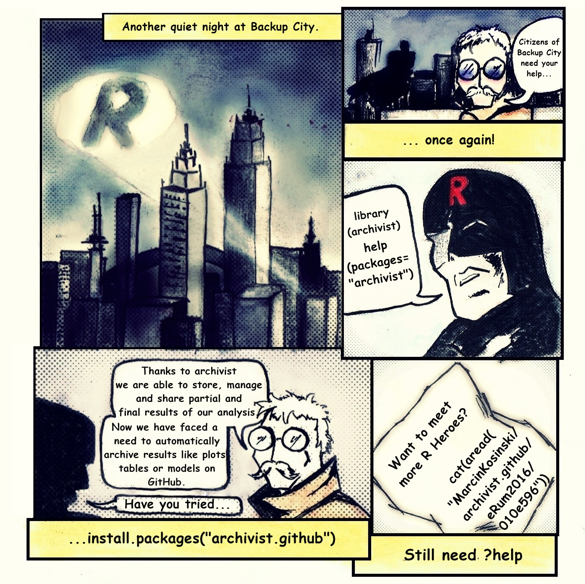

```{r include = FALSE}
library(knitr)
opts_chunk$set(
	comment = "",
	fig.width = 12, 
	message = FALSE,
	warning = FALSE,
	tidy.opts = list(
		keep.blank.line = TRUE,
		width.cutoff = 150
		),
	options(width = 150),
	eval = TRUE
)
```


> This vignette provides useful links for version 0.2.0.

# CRAN index

[archivist.github: Tools for Archiving, Managing and Sharing R Objects via GitHub](https://cran.r-project.org/web/packages/archivist.github/index.html)

# Installation

```{r, eval = FALSE}
install.packages('archivist.github')
```


# Functionalities

The extension of the ['archivist'](https://pbiecek.github.io/archivist/Posts.html) package integrating the archivist with GitHub via GitHub API, 'git2r' packages and 'httr' package.

The workflow of extension can be seen below


# Website

Available after clicking the pleasent octocat 

<a href="https://marcinkosinski.github.io/archivist.github/"></a>

# Paintings and marketing

Paintings were made by [pedzlenie](https://pedzlenie.github.io).

Blog history is below

- [R Hero saves Backup City with archivist and GitHub](http://r-bloggers.com/r-hero-saves-backup-city-with-archivist-and-github)